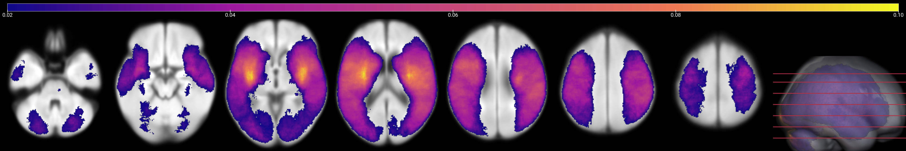
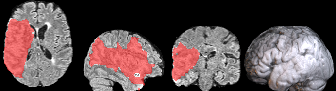
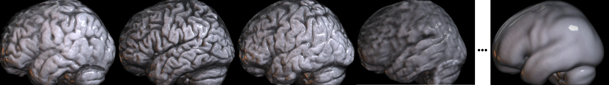

## About

This repository includes scripts to process and analyze images from the original 228 individuals in the [Aphasia Recovery Cohort (ARC) Dataset](https://openneuro.org/datasets/ds004512/), as well as the resulting images derived from the processing. The goal of this repository is to provide a minimal starting point for analyzing the ARC. This educational resource illustrates how to process clinical datasets stored in the [BIDS](https://bids.neuroimaging.io/) format. Our hope is that more sophisticated methods can improve clinical lesion mapping, spatial processing and prediction.

### Scripts

The Matlab Scripts require Matlab, [SPM12](https://www.fil.ion.ucl.ac.uk/spm/software/download/), and the [clinical toolbox](https://github.com/neurolabusc/Clinical) installed. All scripts require the raw data provided from the [Stroke Outcome Optimization Project (SOOP)](https://openneuro.org/). Users will need to adjust the paths for the scripts to match their file system.

The Matlab scripts must be run first:

 - `acuteNormalize.m` : this Matlab script spatially normalizes lesions and images using the clinical toolbox for SPM. For each indvidual, it assumes a FLAIR scan, a TRACE scan and a lesion drawn on the TRACE. It first coregisters the TRACE image to the FLAIR image, transforming the lesion to FLAIR space. The FLAIR scan is then normalized into standard space using the FLAIR template. This transform is used to warp the lesion into standard space. The T1w image is also brain extracted based on estimates of gray and white matter from the unified segmentation-normalization. One should specify the input folder (`inDir`, which is the `outDir` for bidsHarvest), and output folder (`outDir`) as well as a path for temporarily storing intermediate images (`tempDir`).

The Python scripts assume the Matlab scripts have been run. Each file will require the user to specify paths for their file system.

 - `nii2meanLesion.py` : Creates an average lesion map (showing incidence of injury).
 - `nii2meanFLAIR.py` : Creates an average FLAIR image.
 - `bids_bitmaps.py` : Creates one PNG image per participant allowing visual inspection to determine that the normalization performed well.
 - `lesion2artery.py` : creates a tab-separated value file named `artery.tsv` to identify the proportion of each region of the [Arterial Atlas](https://www.nitrc.org/projects/arterialatlas) that has been damaged for each individual.
 - `clean_artery_tsv.py` : given the `artery.tsv` file, create a new tsv file named `artery_cleaned.tsv` that only contains columns with variability. By default, it uses a [5% sufficient affection threshold](https://www.ncbi.nlm.nih.gov/pmc/articles/PMC6866937/).
 - `clean_participant_tsv.py` : given a BIDS format `participants.tsv` file, create a new file `participants_cleaned.tsv` that only contains the variables of interest. Without modification, this script will preserve the first, third and fifth columns (`subject_id`, `age` and `nihss`) from `participants.tsv` in the new file `participants_cleaned.tsv`.
 - `merge_artery_tsv.py` concatenates the files `participants_cleaned.tsv` and `artery_cleaned.tsv` to create `merged_artery_participants.tsv`. Note that some participants do not have lesions, so only rows where the participant is named in both input files are preserved.
 - `deep_learn.py` : uses lesion and patient age to predict patient's impairment on the NIH Stroke Scale (NIHSS). This script reads the `participants_cleaned.tsv` file. You can edit this file to set the features that are included and excluded.

By default, the `deep_learn.py` should report both neural network and support vector regression predictions:

```
Neural Network - Correlation (R): 0.5142377941206763, p-value: 2.6454265340519674e-62
SVR - Correlation (R): 0.5501800789686954, p-value: 8.097513252055928e-73
```

Note the performance is numerically somewhat better than what is achieved by uncommenting the line `columns_to_keep = ['age_at_stroke', 'lesion_volume', rv]`. This constrained model ignores regional injury, and reflects the [potency of lesion volume to predict generalized impairment measures](https://pubmed.ncbi.nlm.nih.gov/37741168/). From first principles, one might expect additional features to improve performance as the dataset size is increased and more specific behavioral measures are provided. The performance of this simpler model is:

```
Neural Network - Correlation (R): 0.49739806569287565, p-value: 8.537857290618983e-58
SVR - Correlation (R): 0.4785154590654683, p-value: 4.973518502919079e-53
```



### NIFTI

These are the derived [NIfTI format](https://brainder.org/2012/09/23/the-nifti-file-format/) images created by the lesionNorm script. These can be viewed with many neuroimaging tools, including our [web-based drag-and-drop NiiVue](https://niivue.github.io/niivue/features/basic.multiplanar.html).

 - `wsub-*_FLAIR.nii.gz` : anatomical T2-weighted FLAIR MRI scan from each participant warped (`w`) to standard space and [SynthStrip](https://pubmed.ncbi.nlm.nih.gov/35842095/) brain-extracted. ** [Due to the large file size, these images are not provided on Github. These are available from OSF](https://osf.io/yqktj/)**
 - `bwsrsub-*_lesion` : map of injury from each individual warped to standard space.
 - `ArterialAtlas136.nii.gz` : [arterial atlas](https://www.nitrc.org/projects/arterialatlas) of brain regions, in same space as individual images.
 - `ArterialAtlas136.txt` : Text file which provides name and index number for brain regions in the atlas.
 - `FLAIR_mean_1714.nii.gz` : Average FLAIR image for all participants.
 - `lesion_mean_1449.nii.gz` : Average lesion map for all participants.
 


### PNG

These bitmap images are created by the `bids_bitmaps.py` and aid quality assurance for the image processing.

 - `wsub-M*.png` provide orthogonal slices (axial, sagittal, coronal) and volume rendered images for the warped and brain extracted T1-weighted MRI scan with the lesion shown as translucent red. The cross-hair is positioned at the center of mass for the lesion. Since brain-extraction is derived from the unified normalization-segmentation algorithm, an accurate brain extraction and cortical surface rendering is consistent with an accurate normalization to standard space.



### How to Acknowledge

If you use SOOP, please cite our work: `update when manuscript reviewed`